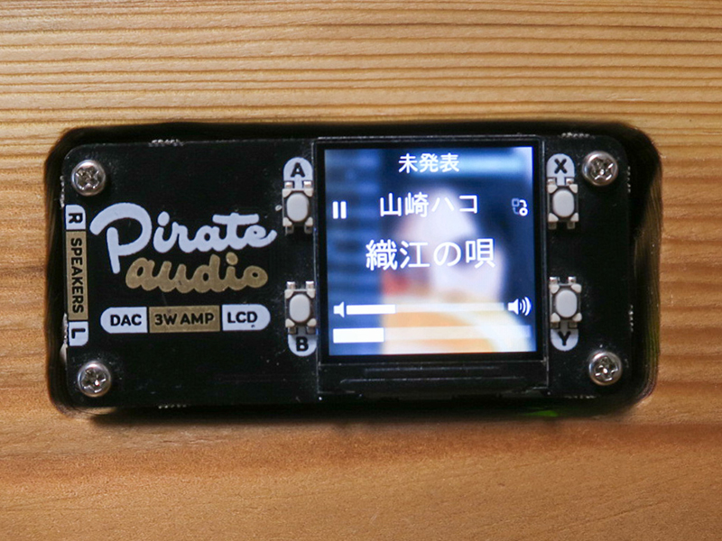
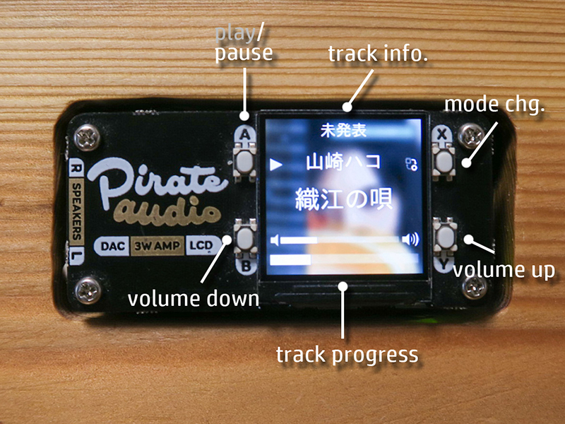
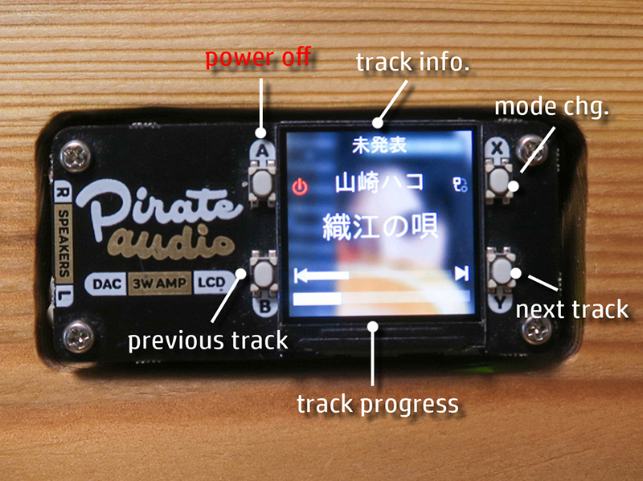

# PirateAudio_Volumio

PIMORONI製のPirate Audioを使用し、RasberryPiで動作のVolumioを操作とLCDに表示。


# インストール
volumioの設定が終わったraspberry piにログインし、ライブラリやgithubから本体をコピーしてきます。

## 必要なライブラリをインストール
### pirateaudio用
``` bash
$ sudo apt update
$ sudo apt install python-rpi.gpio python-spidev python-pip3 python-pil python-numpy
$ sudo pip3 install st7789
```
### 日本語フォント
``` bash
$ sudo apt install fonts-ipgexfont
```
## 設定
### /boot/cconfig.txtに追加
``` bash
$ sudo vi /boot/config.txt
```
最後に追加します。
``` vim
gpio=25=op,dh
dtparam=spi=on
gpio=16=pu
gpio=20=pu
```

## githubからコピー
ホームディレクトリ `/home/volumio/`にgithubからコピーをします。
``` bash
$ git clone https://github.com/hakutai/PirateAudioVolumio.git
```

## 自動起動の設定
プログラムが自動起動出来るよう、サービスに登録します。
``` bash
$ cd PirateAudioVolumio
$ sudo chmod +x PirateAudioVolumio.py
$ sudo cp pirateaudio.service /etc/systemd/system
$ sudo systemctl start pirateaudio.service
$ sudo systemctl enable pirateaudio.service
```

## 再起動
``` bash
$ sudo reboot
```

# プログラムに関し
* raspberry Pi zeroに合わせ横スクロールのタイミングを設定してます、プログラム最後の`sleep(0.1)` この値を変えるとスクロール速度も変わります、ラズパイ０の場合は0.1秒のスリープでCPUが50%強となってます。
* フォントの変更は適時、お好きな物を入れパスなどを指定ください。


# 操作
** X **ボタンを押下することで、各ボタンの操作が変わります。
## Play/Pauseと音量操作


## トラック操作とパワーオフ


# 今後
* volumioの仕様で「previous track」が前曲に行かず、いつも曲頭になるのを、連続2度押しで前曲になるとか。
* 演者の横スクロールが、ボタンアイコンにかかる部分の修正。
* アイコンが小さいかな？
* 